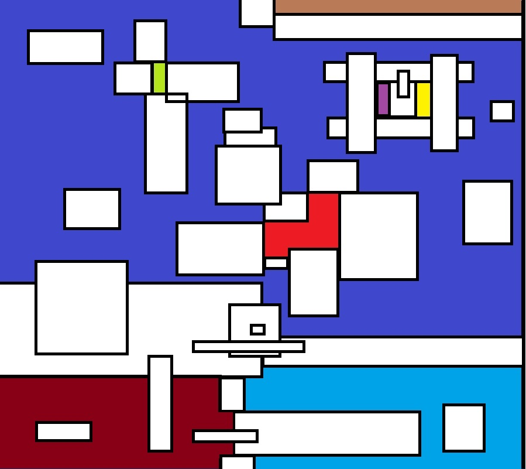

# Target-Assessment
Barren Land Analysis

To run the application, simply insert the command python farm.py  
Python3 is installed on most machine nowadays, if for some reason it isn't the case: https://www.python.org/downloads/  
Testing: If presented with the interactive query, that means the tests passed. Before this menu is presented, there are four assertions representing the two given test cases and two additional ones.  
 
The interactive query is fairly straightforward, you can insert input howevery many times you'd like.  
 
An example "dialog" {no spaces before and after the comma}:  
 
python farm.py  
Insert following format: x0 y0 x1 y1,x0 y0 x1 y1,x0 y0 x1 y1,... etc], or ctrl+c to quit  
example input: 1 101 100 200,51 131 70 198,51 111 115 205  
1 101 100 200,51 131 70 198,51 111 115 205  
[228325]  
1 1 1 1, 3 3 3 3  
probably bad input  
1 1 1 1,3 3 3 3  
[239998]  
0 292 399 307  
[116800, 116800]  
48 192 351 207,48 392 351 407,120 52 135 547,260 52 275 547  
[22816, 192608]  
